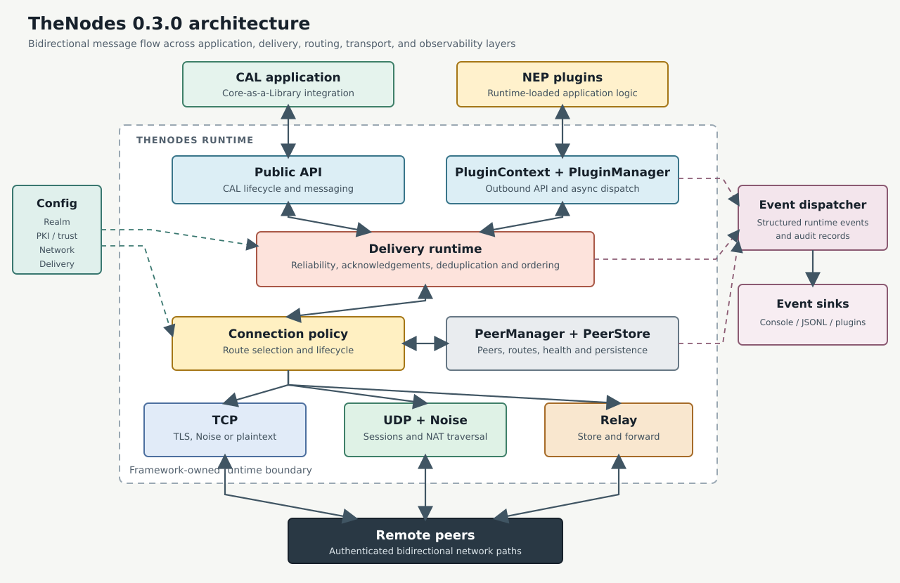

# TheNodes Development Guide

[](https://crates.io/crates/thenodes)
[](https://docs.rs/thenodes)
[](https://thenodes.dev)

Repository: https://github.com/TheNodesDev/TheNodes

## Install

TheNodes 0.4.0 requires Rust 1.83 or newer.

Add to your Cargo.toml:

```toml
[dependencies]
thenodes = "0.4.0"
```

This guide targets version 0.4.0.

Dynamic plugins must use the same TheNodes release as the host. Pin plugin dependencies to the exact host version when reproducible ABI matching is required. TheNodes 0.4.0 uses plugin ABI version 3.

### Cargo Features

The default feature set is empty. TLS and plaintext TCP support are always
available.

| Feature | Enables | Runtime activation |
|---------|---------|--------------------|
| `noise` | TCP Noise plus UDP Noise sessions and NAT traversal | Set `encryption.enabled = true` with `backend = "noise"` and/or enable `[network.udp]` and `[network.nat_traversal]` |
| `upnp` | UPnP-IGD discovery, TCP port mapping, renewal, and NAT diagnostics | Set `[network.nat].enabled = true` |

Enable both optional features with:

```sh
cargo build --release --features noise,upnp
```

Compile-time features and runtime settings are independent: enabling a Cargo
feature makes the implementation available but does not activate it.

## What Is TheNodes?

TheNodes is a modular, async-first peer-to-peer (P2P) node framework. It supplies the plumbing — network transport, peer discovery, identity, trust / encryption (TLS or Noise), realms (isolation domains), event instrumentation, and a dynamic plugin system — so you can focus on application logic.

### Core Value Proposition
- Reuse a battle-tested networking + trust substrate instead of re‑inventing sockets, identity, and message routing.
- Isolate your domain code into loadable plugins for easier upgrades, selective deployment, and cleaner boundaries.
- Select among direct TCP, UDP + Noise, relay, and relay-coordinated UDP hole punching through framework-owned connection policy.
- Choose explicit fire-and-forget, reliable, or ordered-reliable delivery semantics instead of implementing retries and deduplication in every application.
- Optionally host multiple distinct realms (each a discrete, durable network) side‑by‑side with one binary for development, testing, or specialized gateway nodes. (In normal production operation a node process commits to a single realm for its lifetime; a realm name is analogous to a public network identity like a "mainnet" label and is not something nodes hop between.)
- Gain structured events (JSONL) for auditing, metrics, and security introspection.

### Integration Models
1. NEP (Node-Embedded Plugins) – Run the provided host binary; it loads plugins from a directory.
2. CAL (Core-as-a-Library) – Embed the library in your own binary and drive the lifecycle yourself.

Daemon deployment is simply NEP mode operated headlessly under a supervisor (systemd, Docker, Kubernetes). No separate “service mode” is required.

### Intended Use Cases
- Robust distributed coordination or messaging fabrics requiring clear isolation boundaries (realms) and auditability.
- Edge / IoT overlay networks where safety, controlled trust establishment, and incremental rollout matter.
- Secure multi-tenant or multi-environment deployments (prod vs staging vs lab) sharing the same binary but strictly partitioned.
- Extensible application networks where operators plug in domain logic (KV, metrics, workflow, policy) without touching core.
- Evolution of new or existing P2P protocol features with guard rails (add variants/plugins while keeping core stable).

### Non-Goals (Current)
- Bundled consensus / blockchain implementation (can be layered via plugins if desired).
- Turnkey distributed storage/database semantics (state management kept minimal on purpose).
- Built-in certificate issuance / ACME automation (external PKI tooling assumed; we focus on consumption & policy).
- Heavy RPC surface (intentionally remains a lean messaging core—higher abstractions belong in plugins).

### When To Choose TheNodes
Choose TheNodes when you need a security-conscious, extensible P2P node foundation with:
1. Clear separation between infrastructure (core) and application logic (plugins).
2. Realm-based isolation for environments / tenants.
3. Optional but structured trust & encryption controls (TLS + policy) without locking you into one PKI workflow.
4. An async-first Rust implementation emphasizing memory safety and predictable performance.

If your requirement is only basic request/response between a few services, a simpler HTTP/QUIC stack may suffice. If you aim to grow a multi-feature overlay where safety, controlled evolution, and auditability matter, TheNodes fits.

### Implementation Language & Portability
This reference implementation is written in Rust to leverage strong compile-time guarantees, memory safety without GC, and an async ecosystem (Tokio) well-suited for high concurrency. Other implementations (different languages or specialized runtime targets) are welcome and encouraged; the architectural concepts—realms, message types, plugin-driven extension—are intentionally portable.

### High-Level Architecture


The editable diagram source is available in [Mermaid format](docs/architecture.mmd).

Outbound traffic uses the delivery layer and connection policy to select TCP, UDP, or relay. Inbound traffic is authenticated and decoded by its transport, processed by the delivery layer, and asynchronously dispatched to subscribed plugins. Configuration, realm checks, trust policy, peer state, and structured events are framework-owned concerns shared across these paths.

### Design Principles
- Async-first (non-blocking everywhere it matters).
- Least surprise: user config always overrides plugin defaults.
- Additive extensibility: new message variants and config keys shouldn’t break existing deployments.
- Observability: structured, typed events over ad-hoc printlns.

For API stability expectations see `STABILITY.md`. For contributing guidance see `CONTRIBUTING.md`.

## Project Structure

```
TheNodes/
├── Cargo.toml                     # Project manifest
├── CHANGELOG.md                   # Changelog (Keep a Changelog format)
├── STABILITY.md                   # Declared stability surface
├── CONTRIBUTING.md                # Contribution guidelines
├── config/                        # Example node configurations
│   └── example.toml
├── pki/                           # Runtime PKI material (own/trusted/observed)
│   ├── own/
│   ├── trusted/
│   ├── observed/
│   ├── rejected/
│   └── issuers/                   # (optional, may be empty)
├── data/                          # Node state directories (node_id persistence)
├── logs/                          # JSONL audit/event logs
├── src/
│   ├── bin/
│   │   ├── thenodes-cert.rs       # Self-signed certificate helper
│   │   └── thenodes-ctl.rs        # Offline trust and certificate administration
│   ├── lib.rs                     # Library entry point (CAL mode)
│   ├── main.rs                    # Standalone host binary (NEP mode)
│   ├── prelude.rs                 # Curated stable-intent exports
│   ├── constants.rs               # Global constants & defaults
│   ├── config.rs                  # Config & ConfigDefaults logic
│   ├── events/                    # Event model & dispatch
│   │   ├── mod.rs
│   │   ├── dispatcher.rs
│   │   ├── init.rs
│   │   ├── macros.rs
│   │   ├── model.rs
│   │   └── sink.rs
│   ├── network/                   # P2P networking & discovery
│   │   ├── mod.rs
│   │   ├── bootstrap.rs
│   │   ├── connection.rs          # Path selection and connection lifecycle policy
│   │   ├── delivery.rs            # Delivery classes, retries, ACKs, ordering
│   │   ├── events.rs              # Internal network event helpers
│   │   ├── listener.rs
│   │   ├── peer.rs
│   │   ├── peer_manager.rs
│   │   ├── peer_store.rs
│   │   ├── message.rs
│   │   ├── nat_traversal.rs       # Observation and UDP hole-punch coordination
│   │   ├── protocol.rs
│   │   ├── relay.rs               # Relay node handlers (bind, forward, unbind)
│   │   ├── transport.rs
│   │   ├── udp_listener.rs        # Feature-gated UDP + Noise listener
│   │   └── udp_session.rs         # TNCF framing and Noise UDP sessions
│   ├── plugin_host/               # Dynamic plugin loading & orchestration
│   │   ├── mod.rs
│   │   ├── loader.rs
│   │   └── manager.rs
│   ├── prompt/                    # Interactive prompt support
│   │   └── mod.rs
│   ├── realms/
│   │   ├── mod.rs
│   │   └── realm.rs
│   ├── security/                  # Encryption / trust policy
│   │   ├── mod.rs
│   │   ├── encryption.rs
│   │   ├── secure_channel.rs
│   │   └── trust.rs
│   └── utils/                     # Misc helpers (kept minimal intentionally)
│       └── mod.rs
├── examples/
│   ├── simple_node.rs             # Simple embedded usage example
│   └── kvstore_plugin/            # Example plugin crate
│       ├── Cargo.toml
│       └── src/lib.rs
├── plugins/                       # Deployed runtime plugin artifacts (.so/.dylib/.dll)
│   └── libkvstore_plugin.so
├── tests/                         # Integration / behavioral tests
│   ├── connection_lifecycle.rs
│   ├── connection_policy.rs
│   ├── delivery_semantics.rs
│   ├── mtls.rs
│   ├── nat_traversal.rs
│   ├── node_id_uniqueness.rs
│   ├── pins.rs
│   ├── plugin_dispatch.rs
│   ├── promotion_event.rs
│   ├── trust_policy.rs
│   └── udp_transport.rs
├── docs/                          # Architecture, guides, security, and releases
│   ├── architecture.mmd           # Editable Mermaid architecture source
│   ├── architecture.svg           # Rendered architecture diagram
│   ├── EVENTS_RELIABILITY_AND_CONSENSUS_PLAN.md
│   ├── PLUGIN_AUTHORING.md
│   ├── PLUGIN_STORAGE_DECISION.md
│   ├── SECURITY.md
│   ├── SECURITY_TRUST_POLICY_PLAN.md
│   ├── releases/                  # Release-note standard and published notes
│   │   ├── README.md
│   │   ├── v0.3.0.md
│   │   └── v0.4.0.md
│   └── adr/                       # Architecture Decision Records
│       ├── 0001-secure-channel-abstraction.md
│       ├── 0002-persistent-peer-store.md
│       ├── 0003-relay-nodes.md
│       ├── 0004-udp-noise-transport.md
│       ├── 0005-nat-traversal-and-connection-policy.md
│       ├── 0006-delivery-semantics-and-reliability-model.md
│       ├── 0007-connection-lifecycle-policy.md
│       ├── 0008-transport-agnostic-fingerprint-trust.md
│       ├── 0009-upnp-port-mapping-and-nat-diagnostics.md
│       └── 0010-explicit-relay-payload-framing.md
└── README.md
```

## Key Concepts

- **Node-Embedded Plugins (NEP):** Main binary hosts plugins for app logic.
- **Core-as-a-Library (CAL):** Node logic as a reusable library.
- **Realms:** Logical isolation domains; nodes must have matching canonical realm codes and versions to interact.
- **Connection policy:** Framework-owned selection among direct TCP, direct UDP, hole punching, and relay routes.
- **Delivery semantics:** Fire-and-forget, reliable, and ordered-reliable message delivery with stable message IDs and runtime-scoped deduplication.

## Distribution Model (Both Modes)

**Important:** Both NEP and CAL modes use TheNodes as **compiled/distributed code**, not source code in your project directory.

**NEP Mode:**
```
my-app/
├── thenodes              # Pre-built binary (downloaded/installed)  
├── plugins/
│   └── libmydomain.so    # Your compiled plugin (.so/.dylib/.dll)
├── config/
│   └── app.toml
└── my-plugin-src/        # Separate plugin development project
    ├── Cargo.toml        # Depends on thenodes = "=0.4.0" for Plugin trait
    └── src/lib.rs        # Your plugin code
```

**CAL Mode:**
```
my-app/
├── Cargo.toml            # Lists thenodes = "0.4.0" as dependency
├── src/
│   └── main.rs           # Your app using TheNodes APIs  
└── config/
    └── app.toml
```

**Key Point:** You **do not** need TheNodes source code in either mode. TheNodes is distributed as:
- **NEP:** Pre-compiled binary + library for plugin development
- **CAL:** Library crate dependency (like tokio, serde, etc.)

The only exception is if you want to modify TheNodes core itself (contributions) or build from source instead of using releases.

## Where Your Application Logic Belongs

If you are adopting TheNodes primarily for its networking, discovery, realms, and trust layers, put **all domain / business logic in one or more plugins**, not in the core `src/` tree. Reasons:

- Separation of Concerns: Core stays focused on transport, identity, trust, and protocol primitives.
- Upgrade Flexibility: You can update TheNodes independently of your app code.
- Deployment Modularity: Enable/disable features by choosing which plugin libraries (`.so`/`.dylib`/`.dll`) to ship.
- Testability: Plugins can be unit/integration tested in isolation using only the stable-intent API (see `prelude`).

Recommended layout for an application using NEP mode:
```
my-app/
  thenodes/              # git submodule or dependency
  plugins/
  libmydomain.so       # core domain logic (use appropriate extension)
  libmetrics.so        # metrics / observability extension
  libworkflow.so       # higher-level orchestration
  config/
    app.toml
```

When to modify core instead:
- You are contributing generic capabilities (e.g., a new transport) beneficial to all users.
- You are extending message schema in a reusable way (new `MessageType` variant with broad applicability).

CAL Mode Note: When embedding as a library, you *may* still internally structure logic like plugins (using the trait) or directly call APIs; prefer the plugin boundary if you foresee later moving to NEP runtime loading.

## Build & Run

- **Build as library (CAL):**
  ```sh
  cargo build --release --lib
  ```
- **Build standalone NEP host:**
  ```sh
  cargo build --release
  ```
- **Run with config:**
  ```sh
  cargo run --bin thenodes -- --config config/example.toml
  ```
- **Prompt mode:**
  ```sh
  cargo run --bin thenodes -- --config config/example.toml --prompt
  ```
  In prompt mode you can type `version` (or `about`) to display the running application version, protocol version, git commit (if embedded), and build timestamp.

## Networking and Delivery

Version 0.4.0 adds optional UPnP-IGD port mapping, NAT diagnostics, explicit relay
payload framing, Noise static-key trust, and isolated plugin data directories. The
UDP + Noise transport, connection policy, lifecycle monitoring, and delivery
semantics introduced in 0.3.0 remain available.

### UDP + Noise Transport

UDP transport is opt-in and requires the `noise` Cargo feature:

```sh
cargo build --release --features noise
```

```toml
[network.udp]
enabled = true
listen_port = 50002          # Defaults to the TCP port + 1
max_datagram_bytes = 1200    # Maximum supported value
max_app_payload_bytes = 1176 # Maximum supported value
```

The UDP listener uses Noise XX sessions and TNCF control frames. When enabled, HELLO can include optional UDP listen and observed addresses, and the framework tracks UDP sessions independently of mutable network paths.

### Connection Policy and Lifecycle

Connection policy chooses routes and owns heartbeat, route-health, and automatic reconnect behavior:

```toml
[network.connection_policy]
strategy = "direct_then_relay"
direct_tcp_timeout_ms = 3000
direct_udp_timeout_ms = 1000
punch_timeout_ms = 5000
heartbeat_interval_ms = 30000
heartbeat_timeout_ms = 90000
reconnect_base_delay_ms = 1000
reconnect_multiplier = 2.0
reconnect_max_delay_ms = 60000
reconnect_max_attempts = 8
reconnect_jitter_ratio = 0.2
```

Supported strategies are `direct_only`, `direct_then_relay` (default), `direct_then_udp_then_relay`, `direct_then_punch_then_relay`, and `relay_only`. Active routes are tracked as unknown, healthy, suspect, or unresponsive. Known TCP peers can be reconnected with bounded exponential backoff and jitter.

### NAT Traversal

NAT traversal uses the same UDP socket as the Noise transport. It performs observed-address discovery and can coordinate UDP hole punching through an authenticated relay or rendezvous peer. Hole punching is best-effort; relay remains the fallback for networks where direct UDP is unavailable.

```toml
[network.nat_traversal]
enabled = false
serve = false
refresh_secs = 300
cookie_ttl_secs = 30
probe_count = 6
probe_interval_ms = 100
```

Enabling traversal requires `[network.udp].enabled = true` and a build with the `noise` feature. Serving observation and punch coordination additionally requires `[network.relay].enabled = true`.

Optional UPnP-IGD support maps the TCP listen port and advertises the public mapping
through HELLO metadata:

```sh
cargo build --release --features upnp
```

```toml
[network.nat]
enabled = true
lease_duration_secs = 3600
```

NAT diagnostics compare fresh observed UDP endpoints and the gateway address. PCP
and NAT-PMP are not implemented in 0.4.0.

### Delivery Semantics

The delivery layer provides three classes:

- `FireAndForget`: succeeds when the local framework accepts the message for transmission; no remote acknowledgement is required.
- `Reliable`: uses a stable UUID v7 message ID, framework acknowledgements, retries, and duplicate suppression.
- `OrderedReliable`: adds ordering within a required caller-supplied ordering key.

Plugins send through `PluginContext::deliver_message(...)` or `PluginContext::send_message(...)` with `DeliveryOptions`. Delivery state, deduplication, retries, and ordering are scoped to the current process lifetime and are not durable across restarts.

```toml
[network.delivery]
fire_and_forget_timeout_ms = 1000
reliable_timeout_ms = 5000
ordered_reliable_timeout_ms = 10000
reliable_retry_budget = 3
ordered_reliable_retry_budget = 3
dedup_window_secs = 3600
ordered_max_buffered_messages = 1024
retry_interval_ms = 500
```

## Security

Security controls are explicit and configurable. Network encryption is off by default and must be enabled for production deployments.

- Production templates enable TLS by default and recommend mTLS with a restrictive trust policy (allowlist/pins) for production.
- The runtime default remains configurable; if `encryption.enabled = false`, transport is plaintext (suitable for local/development only).
- Read the full guidance and PKI layout in `docs/SECURITY.md`.

### Encryption Backends

TheNodes supports pluggable encryption backends via the `encryption.backend` config key:

| Backend | Description | Feature |
|---------|-------------|---------|
| `tls` | Rustls-based TLS with certificates (default when enabled) | always available |
| `noise` | Noise Protocol (XX handshake, 25519, ChaChaPoly, BLAKE2s) | requires `noise` feature |
| `none` | Plaintext (explicit disable) | always available |

To enable Noise protocol support, build with the feature flag:

```sh
cargo build --release --features noise
```

Configuration example:

```toml
[encryption]
enabled = true
backend = "noise"    # or "tls" (default) or "none"
```

The Noise implementation uses `Noise_XX_25519_ChaChaPoly_BLAKE2s`. The fields under `[encryption.noise]` are reserved for future backend configurability and do not select alternative algorithms in this release.

When `backend = "noise"` but the `noise` feature is not compiled in, secure-channel creation fails with an explicit error. Connections are rejected without falling back to plaintext. Build with `--features noise` to use this backend.

Noise is intentionally not a default Cargo feature. Its remote static key is
fingerprinted with SHA-256 after the XX handshake and evaluated through the same
core trust modes used for TLS fingerprints:

```toml
[encryption.noise.trust_policy]
mode = "allowlist" # open | allowlist | tofu | observe
store_new = "none"
allowlist_fingerprints = ["<sha256-hex>"]
pin_fingerprints = ["<sha256-hex>"]

[encryption.noise.trust_policy.paths]
allowlist_dir = "pki/noise/trusted"
observed_dir = "pki/noise/observed"
```

### TLS & Trust Policy (Overview)
TheNodes supports optional TLS. When disabled, traffic is plaintext (development / controlled environments). When TLS is enabled, the `[encryption.trust_policy]` `mode` controls how peer certificates are evaluated. The currently implemented modes behave as follows:

- `open` – accept any presented certificate (while still applying pinning and validity flags if configured). Useful for quick internal experiments. When `store_new_certs = "observed"`, first-seen certs are copied into the observed directory.
- `allowlist` – only accept certificates whose SPKI fingerprint already exists in `pki/trusted/certs`. New fingerprints are rejected; when `store_new_certs = "observed"`, their certificates can still be recorded for review.
- `observe` – reject every connection after recording the presented certificate in `pki/observed/certs` (or the configured directory). Useful for staged rollouts that want visibility without permitting traffic.
- `tofu` – "Trust On First Use": atomically record the first fingerprint for a peer identity and require that fingerprint on subsequent connections. A writable `observed_dir` and a peer identity are mandatory; otherwise the connection is rejected.
- `hybrid` (placeholder) – currently identical to `open` but tagged in logs so future staged enforcement can be layered on without config churn.

> A dedicated `ca` mode is reserved for a future release. Full CA path validation is already available explicitly through `enforce_ca_chain = true`.

Phased trust policy work adds layered security features without breaking existing configurations.

Phase 2 (current baseline) adds:
- SPKI fingerprint (SHA-256) via ASN.1 parsing (fallback to DER hash only on parse failure).
- Cryptographic WebPKI path validation through `enforce_ca_chain`, using `issuer_cert_dir` as the CA trust-anchor store and `trusted_cert_dir` as a compatibility fallback.
- Real X.509 validity parsing and fail-closed enforcement through `reject_expired` and `reject_before_valid`.
- TLS-role-aware EKU validation for outbound server certificates and inbound mTLS client certificates.
- Expanded logging fields: `chain_valid`, `chain_reason`, `time_valid`, `time_reason`.

Phase 3 (pinning core delivered) adds:
- Pin sets: `pin_fingerprints` (exact SPKI SHA-256 hex) and `pin_subjects` (exact or `~substring`).
- Realm binding: `realm_subject_binding` ensures the active realm name appears in certificate subject (if enabled).
- Enforcement ordering: chain/time flags -> fingerprint pins -> subject pins -> realm binding -> mode logic.
- Promotion helper: move observed certs into trusted directory programmatically (`promote_observed_to_trusted`).

`store_new_certs` only has an effect in modes that actually admit or capture new fingerprints (`open`, `observe`, `tofu`, `hybrid`). Allowlist deployments should populate `pki/trusted/certs` out-of-band or via promotion tooling.

Example trust policy snippet with pinning:
```toml
[encryption.trust_policy]
mode = "allowlist"              # or open | observe | tofu
pin_fingerprints = ["a1b2c3...deadbeef"]
pin_subjects = ["~MyOrg-Nodes", "CN=Node-Primary"]
realm_subject_binding = true
store_new_certs = "observed"     # still useful for TOFU discovery if mode=tofu
accept_self_signed = true         # still honored for self-signed deployments
```

Operational notes:
- Populate pin lists after an initial observation period (e.g., run in TOFU mode, harvest fingerprints from logs / observed dir filenames).
- Certificate rotations require updating pins first to avoid availability loss.
- If any subject-based constraint (pins or realm binding) is active and the subject cannot be parsed, the connection is currently rejected (future soft-fail option planned).

Roadmap (selected upcoming): explicit `ca` / `hybrid` modes and hot reloadable pin sets. CRL/OCSP enforcement is a deliberate non-goal for 0.4.0.

See `SECURITY_TRUST_POLICY_PLAN.md` for detailed status.

### Mutual TLS (mTLS)
Mutual TLS can be enabled to authenticate BOTH sides of a connection. Set `mtls = true` in the `[encryption]` section.

Minimal config example:
```toml
[encryption]
enabled = true
mtls = true                # require and present client certs

  [encryption.paths]
  own_certificate  = "pki/own/cert.pem"
  own_private_key  = "pki/own/key.pem"
  trusted_cert_dir = "pki/trusted/certs"   # leaf allowlist / compatibility root fallback
  issuer_cert_dir  = "pki/issuers/certs"   # CA trust anchors for enforce_ca_chain

  [encryption.trust_policy]
  mode = "allowlist"       # open | observe | allowlist | tofu | hybrid (hybrid placeholder)
  store_new_certs = "observed"  # (optional for tofu mode)

  [encryption.trust_policy.paths]
  observed_dir = "pki/observed/certs"
```

Behavior summary:
- mtls=false (default): Only server cert is presented; client identity at TLS layer is unauthenticated.
- mtls=true: Client presents its certificate; server requires and evaluates it using trust policy.
- allowlist mode + mtls=true: Only peers with certs in `trusted_cert_dir` are accepted.
- tofu mode + mtls=true: First-seen client certificates are bound to their peer identity in `observed_dir`; missing or unwritable TOFU storage rejects the connection.

Operational tips:
- Ensure `own_certificate` / `own_private_key` exist before enabling mTLS.
- Populate `trusted_cert_dir` before switching to `allowlist` + mTLS or connections will be rejected.
- Missing client cert (on outbound) logs a warning and falls back to one-way TLS; inbound without a cert is rejected when mTLS is enabled.

The `enforce_ca_chain` flag performs full WebPKI path validation today. Future phases may add dedicated `ca` / `hybrid` modes without changing the `mtls` flag semantics. CRL/OCSP enforcement remains deferred.

### Logging / Events Configuration
Add an optional `[logging]` section to control event sinks:
```toml
[logging]
json_path = "logs/custom_audit.jsonl"  # JSON lines audit file (rotated)
json_max_bytes = 10485760               # 10 MB before rotation (default 5 MB)
json_rotate = 5                         # keep 5 rotated files (default 3)
disable_console = false                 # set true to disable console sink
```
If `[logging]` is omitted, defaults are applied (`logs/trust_audit.jsonl`, 5MB, 3 rotations, console enabled).

### Node Identity Configuration
Add an optional `[node]` section to configure how a node ID is determined. Order of precedence:
1. Explicit `id` in config.
2. Persisted ID file inside `state_dir` (created if absent).
3. Generated UUID v4 (persisted) if file missing.
4. Ephemeral UUID (only if `allow_ephemeral = true`).

Config example:
```toml
[node]
state_dir = "data/nodeA"   # directory where runtime state (node_id file) is stored
id_file = "node_id"         # filename inside state_dir
# id = "my-static-node"     # uncomment to force a fixed id
allow_ephemeral = true       # if persistence fails, allow an in-memory id
```

On first run (no `id` and no existing file), a UUID is generated and written atomically to `data/nodeA/node_id`.
On subsequent runs the same ID is reused. A `SystemEvent` with action `identity_resolved` is emitted containing the chosen id.

Validation: IDs must be <=128 chars and contain only `[A-Za-z0-9._-]`. Invalid configured IDs trigger a warning and fallback to generation.

Operational tip: Run multiple nodes on the same machine by giving each a distinct `state_dir`.

### Node types and realm access
Some realms may define roles like "daemon", "admin", or custom labels. TheNodes carries an optional node type in the HELLO handshake and can enforce an allow-list per realm.

Config keys:
```toml
[node]
node_type = "daemon" # optional; free-form string defined by your realm/protocol

[realm_access]
allowed_node_types = ["daemon", "admin"] # if set, only these remote types are accepted
```

Notes:
- If `realm_access.allowed_node_types` is omitted, all remote types are allowed.
- If it is set, peers that don't advertise a node type or advertise a non-allowed type are rejected at handshake.
- This is realm-defined policy: choose labels and enforcement aligned with your protocol.

### Event System & Promotion Events

TheNodes uses an asynchronous event pipeline (see `src/events/`) instead of ad-hoc logging. Core domains emit structured events (`TrustDecisionEvent`, `PromotionEvent`, `NetworkEvent`, `PluginEvent`, `SystemEvent`) which are broadcast to registered sinks (console, rotating JSON file, or plugin-defined sinks).

Components:
- `EventDispatcher` – global async fan-out loop.
- `EventHandle` – lightweight clone for emitting events or registering sinks (exposed to plugins).
- Sinks – implement `LogSink` with an async `handle(&self, event: &LogEvent)` method.

`PromotionEvent` is emitted when an observed certificate is promoted to the trusted store via `promote_observed_to_trusted`, providing an immutable audit record of trust-state changes distinct from per-connection `TrustDecisionEvent`s.

Current PromotionEvent fields:
- `fingerprint` (SPKI SHA-256 hex)
- `from_store` / `to_store` (paths)
- `operator` (origin, e.g. `runtime` now; future: `cli`, `api`)
- `success`
- Embedded `meta` (timestamp, session id, level, optional policy checksum)

Example JSON (abridged):
```jsonc
{ "type": "promotion", "fingerprint": "d4b7...ce42", "from_store": "pki/observed/certs/d4b7...ce42.pem", "to_store": "pki/trusted/certs/d4b7...ce42.pem", "operator": "runtime", "success": true }
```

#### Plugin: Registering a Custom Sink
Plugins can capture events (for metrics, forwarding, alerting) by registering a sink during initialization.

Minimal sink pattern:
```rust
use thenodes::events::{sink::LogSink, model::LogEvent};
use thenodes::plugin_host::PluginContext;
use async_trait::async_trait;
use std::sync::Arc;

struct MetricsSink;

#[async_trait]
impl LogSink for MetricsSink {
  async fn handle(&self, event: &LogEvent) {
    if let LogEvent::Promotion(p) = event {
      // increment metrics registry, etc.
    }
  }
}

fn register(ctx: &PluginContext) {
  ctx.events.register_sink(Arc::new(MetricsSink));
}
```

Emitting a plugin-defined event:
```rust
use thenodes::events::{dispatcher, model::{LogEvent, SystemEvent, LogLevel}};
let meta = dispatcher::meta("plugin.example", LogLevel::Info);
ctx.events.emit(LogEvent::System(SystemEvent { meta, action: "started".into(), detail: None }));
```

Roadmap additions: a metrics sink example crate, explicit operator tagging for CLI-driven promotion, and richer trust audit tooling.

## Relay Nodes

TheNodes supports relay functionality for routing messages between peers that cannot directly connect. A node can act as a relay when peers bind to it, enabling store-and-forward messaging for offline peers.

### Wire Protocol

The relay protocol uses the following message types (all use screaming snake case on the wire):

| Message | Purpose |
|---------|---------|
| `RELAY_BIND` | Request to bind a route through the relay to a target peer |
| `RELAY_BIND_ACK` | Acknowledgement with binding status, binding_id, and peer presence |
| `RELAY_FWD` | Opaque forwarding frame with to, from, and sequence fields |
| `RELAY_UNBIND` | Explicit teardown of a binding |
| `RELAY_NOTIFY` | Lifecycle notifications (overload, timeout, peer_left) |
| `ACK` | Hop-level delivery acknowledgement for reliable QoS |

### Quality of Service (QoS)

Four QoS modes control forwarding behavior:

- **`low_latency`**: Bypass store-and-forward entirely; drop if target is offline.
- **`high_throughput`**: Priority enqueue at front for faster draining.
- **`bulk`**: Enqueue at back; soft-drop when per-target cap is reached.
- **`reliable`**: ACK-based delivery with delayed retry (~500ms) cancelled by ACK.

### Store-and-Forward

When peers are offline, messages can be queued for later delivery:
- Per-target queue cap: 1024 messages
- Global queue cap: 8192 messages across all targets
- TTL-based expiry with origin notification on timeout
- Overload notifications sent to origin when caps are reached

### Relay Selection

Deterministic relay selection via Rendezvous (HRW) hashing ensures consistent routing. Peers must advertise the `relay` capability (and optionally `relay_store_forward`) to be selected.

### Configuration

```toml
[network.relay]
enabled = true
store_forward = true
queue_max_per_target = 1024
queue_max_global = 8192
selection = "rendezvous"          # or "none"
```

### Example: Binding to a Relay

```rust
use thenodes::network::relay::RelayBindBuilder;

RelayBindBuilder::new("my-node", "target-peer")
    .store_forward(true)
    .qos("reliable")
    .ttl(3600)  // 1 hour binding TTL
    .send(&peer_manager, &relay_addr, Some(realm.clone()))
    .await;
```

See `docs/adr/0003-relay-nodes.md` for the full design rationale.

## Persistent Peer Store

TheNodes maintains an in-memory peer store that can optionally persist to disk, enabling faster reconnection after restarts.

### Features

- **Peer records**: Each entry tracks `addr`, `source` (Bootstrap/Handshake/Gossip/Manual), `failures`, `last_success_epoch`, `node_id`, and `capabilities`.
- **TTL expiry**: Old entries are filtered on load based on `ttl_secs`.
- **Entry cap**: Maximum entries enforced via `max_entries`; oldest are dropped first (LRU).
- **Periodic flush**: Background task saves store at configurable intervals.
- **Metadata capture**: On successful handshake, `node_id` and `capabilities` are extracted from HELLO and stored.

### Configuration

```toml
[network.persistence]
enabled = true
path = "data/peers.json"          # Override default path
max_entries = 1024                # Maximum stored peers
ttl_secs = 604800                 # 7 days (default)
save_interval_secs = 60           # Flush interval
```

### File Format

Peers are stored as JSON, sorted by most recent success:

```json
[
  {
    "addr": "203.0.113.10:7447",
    "source": "Handshake",
    "failures": 0,
    "last_success_epoch": 1733430000,
    "node_id": "node-abc",
    "capabilities": ["relay", "kv"]
  }
]
```

### Programmatic Access

```rust
use thenodes::network::{PeerStore, PeerSource};

// Load from config
let store = PeerStore::from_config(&config).await;

// Manual operations
store.insert(addr, PeerSource::Manual).await;
store.mark_success(&addr).await;
store.mark_success_with_meta(&addr, Some(node_id), Some(capabilities)).await;

// Sample random peers for discovery
let candidates = store.sample(10, &exclude_set).await;
```

See `docs/adr/0002-persistent-peer-store.md` for the full design rationale.

## Realms
Realms create *overlay boundaries* so multiple independent networks can coexist using the same binary and plugin set.

### Realm = Durable Network Identity
Think of a realm name as the identity of an entire logical network. A node instance normally belongs to exactly **one** realm for its lifecycle. You do **not** routinely point the same long‑running node at different realms day‑to‑day; instead you run separate processes (or deployments) for each realm you operate. The `version` field exists to coordinate protocol evolution *within* a realm without renaming it. Multi‑realm hosting in a single binary is provided mainly for:
- Local development / integration testing.
- Specialized gateway or bridging tooling (future) that must observe or translate between realms.
- Operational convenience when spinning up ephemeral test realms.

Production guidance: pick a concise, stable realm name early (e.g., `prod-messaging`), evolve semantics via capabilities and version numbers, and avoid churn in the name itself. If you truly need a clean‑slate incompatible environment with different trust roots or business purpose, create a **new** realm name and deploy a separate set of node processes.

### Components
- Name and canonical code (primary discriminator)
- Version (coordinates breaking protocol evolution)
- Handshake validation logic

Peer capabilities are separate HELLO metadata used by connection policy and routing. The framework advertises configured support for relay, UDP, punching, punch rendezvous, and a mapped direct TCP route.

### Example Realm Catalog
| Realm              | Purpose                                 | Notes |
|--------------------|-----------------------------------------|-------|
| `my-chat-protocol` | Custom chat app network                 |       |
| `my-sync`          | Custom network to sync servers          |       |
| `prod-messaging`   | Production messaging fabric             | Strict allowlist trust policy |
| `staging-messaging`| Pre-production soak tests               | TOFU accepted initially |
| `sensor-mesh`      | IoT sensor aggregation overlay          | Constrained capabilities |
| `metrics-grid`     | Telemetry distribution layer            | Candidate for QUIC |

### Config Snippet
```toml
[realm]
name = "prod-messaging"
version = "1"
```

### Multi-Realm Deployment
Run a separate process (or systemd template instance) per realm with distinct config, state directory, and (if TLS) PKI material. Pin binary versions per realm if they diverge.

### Upgrade Strategy
1. Add HELLO capabilities additively where possible.
2. Deploy dual-compatible version across realm.
3. Bump `version` only when removing or changing semantics.

### Naming Guidelines
- Include environment + purpose (`prod-`, `stage-`).
- Keep short (<32 chars) and DNS-safe (`[a-z0-9-]`).
- Avoid secrets / internal ticket numbers.

### Troubleshooting Realm Mismatch
Symptom: Disconnect shortly after handshake; event log may show a mismatch. Checklist:
1. Compare `[realm].name`.
2. Check `version` alignment.
3. Check that peers advertise any capabilities required by the selected route.
4. Confirm correct config file loaded by process.

See `src/realms/realm.rs` for validation logic.

## Example Plugin Workflow

1. **Build the plugin:**
   ```sh
   cd examples/kvstore_plugin
   cargo build --release
   ```
2. **Copy the compiled `.so` to the plugin directory:**
   ```sh
   cp target/release/libkvstore_plugin.so ../../plugins/
   ```
3. **Run TheNodes:**
   ```sh
   cd ../../
   cargo run --bin thenodes -- --config config/example.toml
   ```
   The plugin loader will load all plugins from the `plugins/` directory at runtime.

### Plugin ABI Basics

Plugins are compiled as dynamic libraries that expose a single registration symbol with a C-layout function-table boundary. The boundary is explicitly versioned but remains pre-1.0 and can change between TheNodes minor releases.

TheNodes 0.4.0 uses `PLUGIN_ABI_VERSION = 3`. Plugins must implement a stable
`plugin_id()`, use the host-bound context, and be rebuilt against the matching host. A plugin
can call `PluginContext::plugin_data_dir()` to create and obtain its isolated
directory under the node state directory. Plugins own the storage engine and all
schema, migration, locking, and recovery behavior inside that directory.

- The host exports `thenodes::plugin_host::PluginRegistrarApi` and `PLUGIN_ABI_VERSION`. Plugins receive a raw pointer to this struct when they are loaded.
- The struct contains only FFI-safe fields (version, opaque context pointer, function pointers). Helper methods convert it into the familiar `PluginRegistrar` behavior inside the host.
- Use the safe helper `PluginRegistrarApi::register_plugin` to hand the plugin implementation back to the host. The helper performs ABI version checking and reports any mismatch.

Minimal registration pattern inside a plugin crate:

```rust
use thenodes::plugin_host::{Plugin, PluginContext, PluginRegistrarApi};

#[no_mangle]
pub unsafe extern "C" fn register_plugin(api: *const PluginRegistrarApi) {
  let api = match PluginRegistrarApi::from_raw(api) {
    Ok(api) => api,
    Err(err) => {
      eprintln!("[example_plugin] invalid registrar API: {err}");
      return;
    }
  };

  if let Err(err) = api.register_plugin(Box::new(MyPlugin::new())) {
    eprintln!("[example_plugin] failed to register: {err}");
  }
}
```

`PluginRegistrarApi::register_plugin` returns an error if the host and plugin expose different `PLUGIN_ABI_VERSION` values. The current `PluginHandle` carries a Rust trait object, so this is not yet a stable cross-language or arbitrary-toolchain plugin ABI; use matching TheNodes releases and rebuild plugins with the host.

See `docs/PLUGIN_AUTHORING.md` for a complete walkthrough of project setup, registration patterns, testing, and distribution tips.

## License

Licensed under either of:

- Apache License, Version 2.0 (see `LICENSE-APACHE`)
- MIT License (see `LICENSE-MIT`)

at your option.

Unless you explicitly state otherwise, any contribution intentionally submitted for inclusion in this project by you shall be dual licensed as above, without additional terms or conditions.

See `STABILITY.md` for notes on public API and future guarantees.

For more details, see the code comments and the `.github/copilot-instructions.md` for AI agent guidance.
